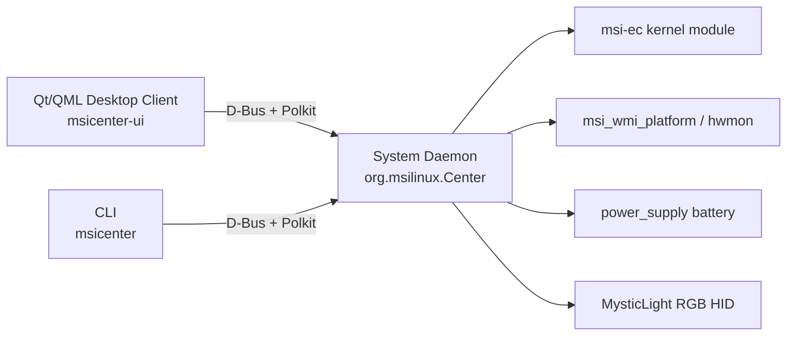
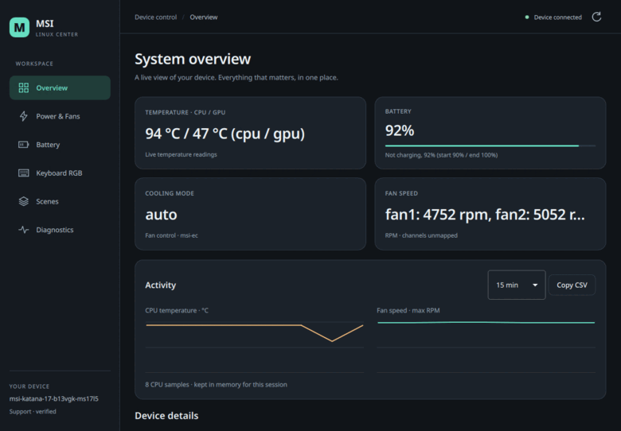
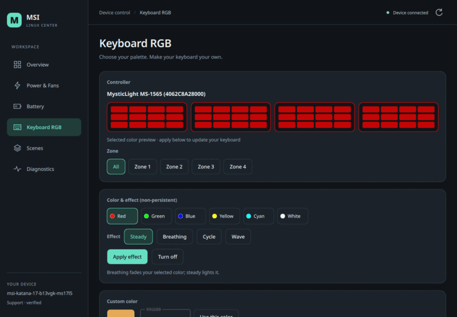

# MSI Katana Center

Linux-native, open-source hardware management for MSI laptops, developed
against the **MSI Katana 17 B13VGK** (board MS-17L5, EC `17L5EMS1.115`) as
the reference device. Rust core + D-Bus daemon + Qt/QML desktop client.

Safety-first: every hardware write is firmware-gated, Polkit-authorized,
opt-in per feature, read-back-verified, and only enabled after physical
verification on the reference laptop. See
[`MSI-Linux-Center-AGENTS.md`](MSI-Linux-Center-AGENTS.md) for the rules.

## Screenshots

| Overview | Page tour | Live telemetry |
|---|---|---|
|  |  |  |

## Features

- **Read-only telemetry** — EC shift/fan modes, CPU/GPU temperatures, fan
  levels and real RPM, battery status and charge thresholds, runtime
  capability reporting
- **Gated, verified writes** — battery charge thresholds, fan mode,
  Cooler Boost, Super Battery, webcam/webcam-block, Fn/Win key swap
- **Keyboard RGB** — MysticLight MS-1565 steady color and effects
  (breathing, cycle, wave), non-persistent by default; flash-save behind
  a separate opt-in
- **Scenes** — named bundles of the gated writes, with CLI and UI
  apply/import/export, starter examples (Quiet / Cool / Battery saver /
  Gaming lights), optional startup/AC-battery/battery-level/schedule
  automation (all opt-in, all UI-owned)
- **System tray** — live temps/RPM tooltip, quick actions, keyboard
  shortcuts (Ctrl+Shift+C/B/L/P)
- **Community diagnostics** — `msicenter report` with no serial numbers
  for upstream support requests
- **Fake-sysroot fixture** — hardware-free development and testing via
  `MSI_LINUX_CENTER_SYSROOT`

## Phase status

| Phase | Scope | Status |
|---|---|---|
| 0 | read-only hardware reconnaissance | complete |
| 1–2 | read-only core, device database, runtime capabilities, fixture | complete |
| 3 | D-Bus daemon, systemd unit, D-Bus policy, Polkit actions | complete |
| 4 | gated semantic writes (battery thresholds, fan mode, Cooler Boost, Super Battery) | complete — physically verified 2026-09-05 |
| 5 | custom fan curves | [design study](docs/phase5-fan-curve-design.md) — no writes until §11 experiment |
| 6 | Qt/QML desktop UI | complete — [design](docs/phase6-ui-design.md) |
| 7 | RGB (MysticLight MS-1565) | `SetRgbColor` physically verified; effect modes implemented; flash-save implemented, physical test pending |
| 8 | scenes | complete — CLI + UI validated |
| 9 | community diagnostics | complete — [design](docs/phase9-diagnostics.md) |
| 10 | MUX | research only — [notes](docs/deferred-features-research.md) |

## Requirements

- Rust toolchain (≥ 1.75)
- Qt 6 (Core, QML, Quick, DBus, QuickControls2, Widgets) + CMake ≥ 3.21
- Linux with `msi-ec` and `msi_wmi_platform` kernel modules for real
  hardware (both read and write paths degrade gracefully when absent)

## Install / uninstall

Builds the release daemon, CLI, and Qt UI, then installs systemd,
Polkit, D-Bus policy, desktop file, and (by default) session autostart.
Write opt-ins stay off.

    ./scripts/setup.sh install
    ./scripts/setup.sh install --no-autostart
    ./scripts/setup.sh uninstall

`uninstall` does not delete `~/.config/msi-linux-center`. Prefix defaults
to `/usr` (`PREFIX`, `SYSCONFDIR`).

## Build from source

Rust core, daemon, and CLI:

    cargo build --release

Qt desktop client:

    cd crates/msicenter-ui && cmake -S . -B build && cmake --build build -j

## Run

Against the included fixture (no hardware needed):

    ./scripts/run-fixture.sh
    ./scripts/run-fixture.sh --json

Read-only on the real laptop:

    ./scripts/run-local-readonly.sh
    cargo run -p msicenter-cli -- status [--json]
    cargo run -p msicenter-cli -- capabilities

Do **not** run the CLI with sudo. Privileged writes are performed only by
the daemon after Polkit authorization.

## Write commands (gated)

Each command requires the daemon to run with the matching opt-in
(`MSI_LINUX_CENTER_ENABLE_*_WRITES=1`) and completes a Polkit prompt:

    msicenter battery-thresholds START END      # e.g. 80 90
    msicenter fan-mode auto|silent|advanced
    msicenter cooler-boost on|off
    msicenter super-battery on|off
    msicenter webcam on|off
    msicenter webcam-block on|off
    msicenter fn-key left|right
    msicenter rgb-color ZONE_MASK RRGGBB        # non-persistent
    msicenter rgb-effect ZONE_MASK MODE SPEED_S COLORS
    msicenter rgb-save                          # persistent flash save (separate opt-in)
    msicenter panic-reset                       # Cooler Boost off, Super Battery off, fan auto
    msicenter scene list|examples|apply NAME

With the opt-in disabled the daemon refuses with `NotSupported`. The
exact support scope, gates, and physical verification records live in
[`docs/dbus-contract.md`](docs/dbus-contract.md) and the
`docs/phase4-*-validation.md` files.

## Safety model

1. **Firmware gate** — writes only run when the device's EC firmware
   exactly matches a physically verified firmware string
2. **Opt-in gate** — every write family is disabled by default behind a
   per-feature daemon environment variable
3. **Polkit gate** — every D-Bus write method maps to a Polkit action
4. **Read-back verification** — EC and battery writes are read back and
   verified; failed writes roll back
5. **Physical verification** — a write path ships only after it has been
   exercised on the reference laptop and recorded in `docs/`
6. **No guessing** — undocumented registers are never written; provenance
   for every hardware feature is recorded in the device profile

## Supported devices

| Device | Status |
|---|---|
| MSI Katana 17 B13VGK (MS-17L5, EC `17L5EMS1.115`) | verified reference device |
| Other MSI laptops with `msi-ec` | read-only telemetry; writes gated by exact firmware match |
| Unmatched models | read-only + diagnostics report; community support via `msicenter report` |

## Documentation

- [`docs/dbus-contract.md`](docs/dbus-contract.md) — D-Bus API contract
- [`docs/phase7-rgb-protocol.md`](docs/phase7-rgb-protocol.md) — MysticLight wire protocol
- [`docs/reverse-engineering-inventory.md`](docs/reverse-engineering-inventory.md) — RE inventory
- [`MSI-Linux-Center-AGENTS.md`](MSI-Linux-Center-AGENTS.md) — safety rules for contributors and agents

## Disclaimer — use at your own risk

This software controls laptop hardware through the embedded controller
(EC), battery charge interfaces, and a USB HID RGB controller. Incorrect
writes to these interfaces can cause instability, thermal problems,
reduced battery life, data loss, or hardware/firmware damage.

**This project is provided "as is", without warranty of any kind, express
or implied. The authors and contributors accept no liability whatsoever
for any damage, data loss, or malfunction arising from the use of this
software — including damage to your laptop, battery, keyboard, or any
other hardware.**

Mitigations built into the project (firmware gating, per-feature opt-ins,
Polkit authorization, read-back verification, physical verification on
the reference device) reduce risk but do not eliminate it. They are
best-effort engineering measures, not guarantees.

- Hardware write features are **disabled by default**; only enable them
  if you understand what they do
- Behavior is physically verified on the **MSI Katana 17 B13VGK**
  (EC `17L5EMS1.115`) only; other models are gated but unverified
- Do not use this software on a laptop you cannot afford to damage, and
  never enable write opt-ins on critical hardware
- If you are unsure, use the read-only telemetry features only

**Be careful. You are solely responsible for any consequences of using
this software.**

## Contributing

Read [`MSI-Linux-Center-AGENTS.md`](MSI-Linux-Center-AGENTS.md) first.
Hardware write paths require provenance, gating, and physical
verification records — PRs that skip these will not be merged.

## License

Dual-licensed under [MIT](LICENSE-MIT) or [Apache-2.0](LICENSE-APACHE),
at your option.
