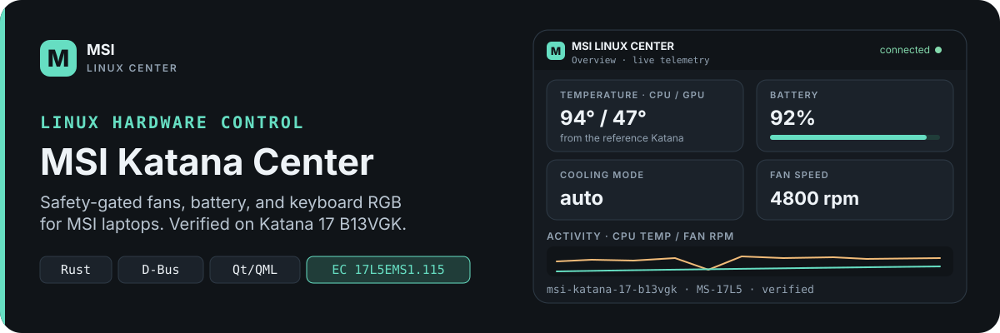
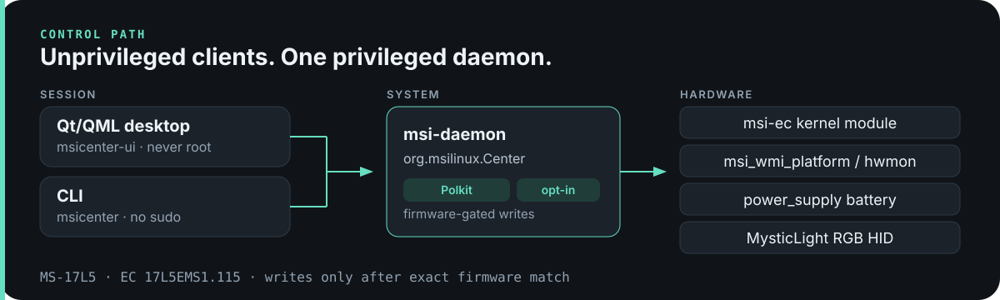
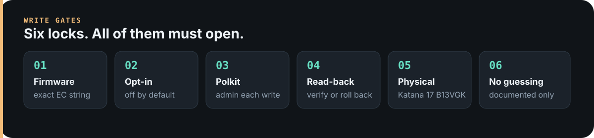

<p align="center">
  
</p>

<p align="center">
  <sub>
    <a href="README.md">English</a> ·
    <a href="README.zh.md">简体中文</a> ·
    <b>Türkçe</b> ·
    <a href="README.de.md">Deutsch</a> ·
    <a href="README.fr.md">Français</a> ·
    <a href="README.sv.md">Svenska</a> ·
    <a href="README.it.md">Italiano</a> ·
    <a href="README.pt.md">Português</a> ·
    <a href="README.es.md">Español</a> ·
    <a href="README.ar.md">العربية</a> ·
    <a href="README.hi.md">हिन्दी</a> ·
    <a href="README.ja.md">日本語</a> ·
    <a href="README.ko.md">한국어</a>
  </sub>
</p>

# MSI Katana Center

[](LICENSE-MIT)
[](https://github.com/mberkanbicer/MSI-Katana-Center/actions/workflows/ci.yml)
[](Cargo.toml)
[](#bağımlılıklar)
[](https://github.com/mberkanbicer/MSI-Katana-Center/wiki)

> Bu dosya topluluk tarafından sağlanan bir çeviridir. Bir çelişki
> durumunda [İngilizce README](README.md) esas alınır.

MSI dizüstü bilgisayarlar için Linux'a özel, açık kaynaklı donanım
yönetim aracı. Referans cihaz olarak **MSI Katana 17 B13VGK**
(anakart MS-17L5, EC `17L5EMS1.115`) baz alınarak geliştirildi. Rust
çekirdeği, D-Bus arka plan servisi ve Qt/QML masaüstü istemcisi.

Her donanım yazma işlemi ürün yazılımı eşleşmesiyle kapılanır,
Polkit ile yetkilendirilir, özellik bazında opt-in (açık onay)
gerektirir, geri okuma ile doğrulanır ve yalnızca referans cihazda
fiziksel olarak doğrulandıktan sonra etkinleştirilir. Kurallar için
bkz. [`MSI-Linux-Center-AGENTS.md`](MSI-Linux-Center-AGENTS.md).

> **Yapay zeka destekli geliştirme bildirimi:** Bu proje tamamen
> "vibecoded" — yani her commit,
> [`MSI-Linux-Center-AGENTS.md`](MSI-Linux-Center-AGENTS.md) içindeki
> kurallara göre çalışan bir yapay zeka kodlama ajanı tarafından
> yazıldı; kapsamı bir insan belirledi, değişiklikleri bir insan
> inceledi ve gerçek donanımda çalıştırılmadan önce her donanım yazma
> işlemi açık bir insan onayıyla kapılandı. Hiçbir kod satırı, tasarım
> belgesi veya fiziksel doğrulama kaydı bu insan denetimi olmadan
> üretilmedi. Bu durum aşağıdaki
> [Sorumluluk Reddi](#sorumluluk-reddi--kendi-riskinizle-kullanın)
> bölümünü değiştirmez: kullanım kendi riskinizdedir, herhangi bir
> yazma opt-in'ini etkinleştirmeden önce güvenlik kapılarını okuyun.

## Canlı Arayüz

<p align="center">
  
</p>

<p align="center">
  
  
</p>

## Bu nedir

EC vites/fan durumunu, sıcaklıkları, RPM'i ve pil durumunu okuyan
bir masaüstü Center uygulaması ve CLI aracı — ve siz onay
verdiğinizde (opt-in) doğrulanmış küçük bir yazma işlemleri
kümesini uygular: şarj eşikleri, fan modu, Cooler Boost,
Super Battery, kamera/Fn tuşları ve MysticLight RGB.

<p align="center">
  
</p>

## Özellikler

- **Salt okunur telemetri** — EC vites/fan modları, CPU/GPU
  sıcaklıkları, çekirdek başına sıcaklık/yük, GPU başına
  sıcaklık/yük, fan seviyeleri ve gerçek RPM, pil durumu ve şarj
  eşikleri, çalışma zamanı yetenek raporlaması
- **Kapılı, doğrulanmış yazmalar** — pil şarj eşikleri, fan modu,
  Cooler Boost, Super Battery, kamera/kamera engelleme, Fn/Win
  tuş değişimi
- **Klavye RGB'si** — MysticLight MS-1565 sabit renk ve efektler
  (nefes alma, döngü, dalga), varsayılan olarak kalıcı değildir;
  flash'a kaydetme ayrı bir opt-in gerektirir
- **Sahneler** — kapılı yazmaların isimlendirilmiş paketleri, CLI
  ve UI üzerinden uygulama/içe-dışa aktarma, başlangıç örnekleri
  (Sessiz / Serin / Pil tasarrufu / Oyun ışıkları), isteğe bağlı
  başlangıçta çalıştırma/AC-pil/pil seviyesi/zamanlama otomasyonu
  (hepsi opt-in, hepsi UI tarafından yönetilir)
- **Sistem tepsisi** — canlı sıcaklık/RPM ipucu, hızlı eylemler,
  klavye kısayolları (Ctrl+Shift+C/B/L/P)
- **Masaüstü arayüzü** — yedi sayfa (Genel Bakış, Soğutma, Güç,
  Pil, Klavye RGB, Sahneler, Tanılama), termal öne çıkan kart,
  sabit birincil eylemler, sahne otomasyonu akordeonu,
  bağlantı/güncel değil durumu ve kuyruklanmış eylem banner'ı
- **Topluluk tanılaması** — üst akış destek talepleri için seri
  numarası içermeyen `msicenter report`
- **Sahte sysroot test ortamı** — `MSI_LINUX_CENTER_SYSROOT` ile
  donanımsız geliştirme ve test

## Kurulum

Release sürümündeki daemon, CLI ve Qt arayüzünü derler, ardından
systemd, Polkit, D-Bus politikası, masaüstü dosyası ve (varsayılan
olarak) oturum otomatik başlatmayı kurar. Birlikte gelen systemd
birimi, pil, fan modu, cooler-boost, RGB, kamera, kamera engelleme
ve fn-key yazma opt-in'lerini varsayılan olarak etkinleştirir;
Super Battery ve RGB flash-kaydetme kapalı kalır. Bu varsayılanlara
bakılmaksızın, her yazma işlemi daemon içinde Polkit ile
kapılanmaya, tam ürün yazılımı eşleşmesine ve geri okuma/geri alma
doğrulamasına tabidir — tamamen salt okunur bir varsayılan
istiyorsanız kurulumdan önce
[`data/systemd/system/msi-linux-center.service`](data/systemd/system/msi-linux-center.service)
dosyasını düzenleyin.

```bash
./scripts/setup.sh install
./scripts/setup.sh install --no-autostart
./scripts/setup.sh uninstall
```

`uninstall`, `~/.config/msi-linux-center` klasörünü silmez. Önek
varsayılan olarak `/usr`'dır (`PREFIX`, `SYSCONFDIR` ile
değiştirilebilir).

### Gereksinimler

- Rust araç zinciri (≥ 1.75)
- Qt 6 (Core, QML, Quick, DBus, QuickControls2, Widgets) +
  CMake ≥ 3.21
- Gerçek donanım için `msi-ec` ve `msi_wmi_platform` çekirdek
  modüllerine sahip Linux (bu modüller yoksa hem okuma hem de
  yazma yolları zarif biçimde geri çekilir)

Tam sistem paketleri ve desteklenen işletim sistemleri için
aşağıdaki [Bağımlılıklar](#bağımlılıklar) bölümüne bakın.

### Kaynaktan derleme

```bash
cargo build --release
cd crates/msicenter-ui && cmake -S . -B build && cmake --build build -j
```

## Çalıştırma

Dahil edilen test ortamına (donanım gerekmez) karşı çalıştırma:

```bash
./scripts/run-fixture.sh
./scripts/run-fixture.sh --json
```

Gerçek dizüstü bilgisayarda salt okunur olarak:

```bash
./scripts/run-local-readonly.sh
cargo run -p msicenter-cli -- status [--json]
cargo run -p msicenter-cli -- capabilities
```

CLI'yi **sudo ile çalıştırmayın**. Yetkili yazmalar yalnızca
Polkit yetkilendirmesinden sonra daemon tarafından gerçekleştirilir.

## Yazma komutları (kapılı)

Her komut, daemon'un ilgili opt-in ile çalışmasını gerektirir
(`MSI_LINUX_CENTER_ENABLE_*_WRITES=1`) ve bir Polkit istemini
tamamlar:

```bash
msicenter battery-thresholds START END      # örn. 80 90
msicenter fan-mode auto|silent|advanced
msicenter cooler-boost on|off
msicenter super-battery on|off
msicenter webcam on|off
msicenter webcam-block on|off
msicenter fn-key left|right
msicenter rgb-color ZONE_MASK RRGGBB        # kalıcı değil
msicenter rgb-effect ZONE_MASK MODE SPEED_S COLORS
msicenter rgb-save                          # kalıcı flash kaydetme (ayrı opt-in)
msicenter panic-reset                       # Cooler Boost kapalı, Super Battery kapalı, fan otomatik
msicenter scene list|examples|apply NAME
```

Opt-in devre dışıyken daemon `NotSupported` ile reddeder. Tam
destek kapsamı, kapılar ve fiziksel doğrulama kayıtları
[`docs/dbus-contract.md`](docs/dbus-contract.md) ve
`docs/phase4-*-validation.md` dosyalarında yer alır.

## Güvenlik modeli

<p align="center">
  
</p>

1. **Ürün yazılımı kapısı** — yazmalar yalnızca cihazın EC ürün
   yazılımı, fiziksel olarak doğrulanmış bir ürün yazılımı
   dizesiyle tam olarak eşleştiğinde çalışır
2. **Opt-in kapısı** — her yazma ailesi kendi özellik bazlı daemon
   ortam değişkeni arkasındadır; birlikte gelen systemd birimi
   varsayılan olarak pil, fan modu, cooler-boost, RGB, kamera,
   kamera engelleme ve fn-key'i etkinleştirir (Super Battery ve
   RGB flash-kaydetme kapalı kalır)
3. **Polkit kapısı** — her D-Bus yazma metodu bir Polkit eylemine
   eşlenir
4. **Geri okuma doğrulaması** — EC ve pil yazmaları geri okunur ve
   doğrulanır; başarısız yazmalar geri alınır
5. **Fiziksel doğrulama** — bir yazma yolu, ancak referans dizüstü
   bilgisayarda test edilip `docs/` içinde kayıt altına
   alındıktan sonra yayınlanır
6. **Tahmin yok** — belgelenmemiş register'lara asla yazılmaz;
   her donanım özelliğinin kökeni cihaz profilinde kayıtlıdır

## Desteklenen cihazlar

| Cihaz | Durum |
|---|---|
| MSI Katana 17 B13VGK (MS-17L5, EC `17L5EMS1.115`) | doğrulanmış referans cihaz |
| `msi-ec` içeren diğer MSI dizüstü bilgisayarları | yalnızca salt okunur telemetri; yazmalar tam ürün yazılımı eşleşmesiyle kapılanır |
| Eşleşmeyen modeller | yalnızca salt okunur + tanılama raporu; `msicenter report` ile topluluk desteği |

<details>
<summary>Faz durumu</summary>

| Faz | Kapsam | Durum |
|---|---|---|
| 0 | salt okunur donanım keşfi | tamamlandı |
| 1–2 | salt okunur çekirdek, cihaz veritabanı, çalışma zamanı yetenekleri, test ortamı | tamamlandı |
| 3 | D-Bus daemon, systemd birimi, D-Bus politikası, Polkit eylemleri | tamamlandı |
| 4 | kapılı semantik yazmalar (pil eşikleri, fan modu, Cooler Boost, Super Battery) | tamamlandı — 2026-09-05'te fiziksel olarak doğrulandı |
| 5 | özel fan eğrileri | [tasarım çalışması](docs/phase5-fan-curve-design.md) — §11 deneyi tamamlanana kadar yazma yok |
| 6 | Qt/QML masaüstü arayüzü | tamamlandı — [tasarım](docs/phase6-ui-design.md) |
| 7 | RGB (MysticLight MS-1565) | `SetRgbColor` fiziksel olarak doğrulandı; efekt modları uygulandı; flash-kaydetme uygulandı, fiziksel test bekleniyor |
| 8 | sahneler | tamamlandı — CLI + UI doğrulandı |
| 9 | topluluk tanılaması | tamamlandı — [tasarım](docs/phase9-diagnostics.md) |
| 10 | MUX | yalnızca araştırma — [notlar](docs/deferred-features-research.md) |

</details>

## Dokümantasyon

- [`docs/dbus-contract.md`](docs/dbus-contract.md) — D-Bus API sözleşmesi
- [`docs/phase7-rgb-protocol.md`](docs/phase7-rgb-protocol.md) — MysticLight iletişim protokolü
- [`docs/reverse-engineering-inventory.md`](docs/reverse-engineering-inventory.md) — tersine mühendislik envanteri
- [`MSI-Linux-Center-AGENTS.md`](MSI-Linux-Center-AGENTS.md) — katkıda bulunanlar ve ajanlar için güvenlik kuralları
- [Proje wiki'si](https://github.com/mberkanbicer/MSI-Katana-Center/wiki) — kurulum, güvenlik modeli, D-Bus API ve SSS'nin gezilebilir hâli

## Bağımlılıklar

**Desteklenen işletim sistemleri** — Yalnızca Linux. Arch Linux ve
Ubuntu üzerinde geliştirildi ve test edildi (CI `ubuntu-latest`
üzerinde çalışır); `systemd`, Polkit, D-Bus, Qt 6 ve güncel bir
Rust araç zincirine sahip herhangi bir dağıtım çalışmalıdır.
Gerçek donanım telemetrisi/yazmaları için `msi-ec` ve
`msi_wmi_platform` çekirdek modülleri gereklidir — proje bunlar
olmadan da derlenir ve test ortamı üzerinden salt okunur olarak
çalışır.

**Gerekli sistem paketleri**

| Paket | Amaç |
|---|---|
| Rust araç zinciri ≥ 1.75 (`cargo`) | tüm Rust crate'lerini derler |
| Qt 6 ≥ 6.4 (Core, Gui, Qml, Quick, DBus, QuickControls2, Widgets) | masaüstü arayüzü |
| CMake ≥ 3.21 | Qt arayüzü derlemesi |
| `pkg-config` | derleme sırasında `libusb-1.0`'ı bulur |
| `libusb-1.0-0-dev` (geliştirme başlıkları) | RGB HID arka ucu, derleme zamanında statik olarak bağlanır |
| `libudev-dev` | donanım/cihaz numaralandırması |
| `systemd`, `polkit`, `dbus` (çalışma zamanı) | daemon servisi, yetki kapılanması, IPC |
| `libusb-1.0-0` (çalışma zamanı) | RGB HID arka ucu çalışma zamanı bağımlılığı |

```bash
# Debian/Ubuntu (CI ile aynı)
sudo apt-get install -y pkg-config libusb-1.0-0-dev libudev-dev

# Arch
sudo pacman -S base-devel cmake qt6-base qt6-declarative libusb systemd polkit
```

**Önemli Rust crate'leri** — `zbus` (D-Bus), `serde`/`serde_json`
(veri + cihaz profilleri), `hidapi` (MysticLight RGB için statik
olarak bağlanan `linux-static-libusb` arka ucu — dağıtımın kendi
`hidapi` paketi bağlantı hatalarına yol açarsa
[SSS](https://github.com/mberkanbicer/MSI-Katana-Center/wiki/FAQ-and-Troubleshooting#the-daemon-wont-start--build-fails-on-hidapi)'e
bakın). Tam bağımlılık grafiği `Cargo.lock` ve her crate'in
`Cargo.toml` dosyasındadır.

**Kullanılan çekirdek modülleri** — [`msi-ec`](https://github.com/BeardOverflow/msi-ec)
(EC semantik durumu, fan modları, Cooler Boost, Super Battery,
kamera/Fn tuşu), `msi_wmi_platform`/hwmon (gerçek fan RPM'i),
Linux `power_supply` (pil durumu ve şarj eşikleri).

**Geliştirme sırasında referans alınan projeler** — yalnızca
araştırma/referans materyali; buradaki hiçbir şey kaynak kod
olarak kopyalanmadı veya bağlanmadı ve her yazma yolu
yayınlanmadan önce bağımsız olarak doğrulandı (bkz.
[Güvenlik Modeli](https://github.com/mberkanbicer/MSI-Katana-Center/wiki/Safety-Model)):

| Proje | Kullanım amacı |
|---|---|
| [GhostDeck](https://github.com/wygodad/ghostdeck) | MSI model/ürün yazılımı bilgisi, EC/register araştırması, fan eğrileri, doğrulama metodolojisi |
| [msi-ec](https://github.com/BeardOverflow/msi-ec) | Linux MSI EC/sysfs semantiği, modlar, Cooler Boost, sıcaklıklar, fan seviyeleri ve desteklenen modeller |
| [MControlCenter](https://github.com/dmitry-s93/MControlCenter) | Linux'ta karşılaştırmalı MSI özellik/UX davranışı |
| [OpenFreezeCenter](https://github.com/YoCodingMonster/OpenFreezeCenter) | yetki ayrımı, Polkit kavramları, fan kontrolü, simülasyon ve kurtarma |
| [msi-katana-rgb](https://github.com/sarpowsky/msi-katana-rgb) | Katana Mystic Light USB/HID protokolü ve 4 bölgeli RGB araştırması |
| [Linux çekirdeği](https://github.com/torvalds/linux) | hwmon, power_supply, WMI, ACPI, HID, DRM ve platform sürücüleri için en yüksek öncelikli uygulama referansı |

## Sorumluluk reddi — kendi riskinizle kullanın

Bu yazılım, gömülü denetleyici (EC), pil şarj arayüzleri ve bir
USB HID RGB denetleyicisi üzerinden dizüstü bilgisayar donanımını
kontrol eder. Bu arayüzlere yapılan hatalı yazmalar kararsızlığa,
termal sorunlara, azalmış pil ömrüne, veri kaybına veya
donanım/ürün yazılımı hasarına neden olabilir.

**Bu proje, açık veya zımni hiçbir garanti olmaksızın "olduğu
gibi" sağlanmaktadır. Yazarlar ve katkıda bulunanlar, bu
yazılımın kullanımından kaynaklanan hiçbir hasar, veri kaybı veya
arızadan — dizüstü bilgisayarınıza, pilinize, klavyenize veya
başka herhangi bir donanıma verilen hasar dahil — hiçbir sorumluluk
kabul etmez.**

Projeye dahil edilen azaltıcı önlemler (ürün yazılımı kapılanması,
özellik bazlı opt-in'ler, Polkit yetkilendirmesi, geri okuma
doğrulaması, referans cihazda fiziksel doğrulama) riski azaltır
ancak ortadan kaldırmaz. Bunlar en iyi çabayla yapılan mühendislik
önlemleridir, garanti değildir.

- Pil eşikleri, fan modu, Cooler Boost, RGB, kamera, kamera
  engelleme ve Fn tuşu yazmaları kurulan systemd biriminde
  **varsayılan olarak etkindir** (Super Battery ve RGB
  flash-kaydetme kapalı kalır); yalnızca ne yaptıklarını
  anlıyorsanız kurun ve tamamen salt okunur bir varsayılan
  istiyorsanız kurulumdan önce birim dosyasını düzenleyin
- Davranış yalnızca **MSI Katana 17 B13VGK** (EC `17L5EMS1.115`)
  üzerinde fiziksel olarak doğrulanmıştır; diğer modeller
  kapılıdır ancak doğrulanmamıştır
- Bu yazılımı, hasar görmesini göze alamayacağınız bir dizüstü
  bilgisayarda kullanmayın ve kritik donanımda asla yazma
  opt-in'lerini etkinleştirmeyin
- Emin değilseniz yalnızca salt okunur telemetri özelliklerini
  kullanın

**Dikkatli olun. Bu yazılımı kullanmanın sonuçlarından tamamen siz
sorumlusunuz.**

## Katkıda bulunma

Önce [`MSI-Linux-Center-AGENTS.md`](MSI-Linux-Center-AGENTS.md)
dosyasını okuyun. Donanım yazma yolları köken bilgisi, kapılanma
ve fiziksel doğrulama kayıtları gerektirir — bunları atlayan
PR'lar birleştirilmeyecektir.

## Lisans

[MIT](LICENSE-MIT) veya [Apache-2.0](LICENSE-APACHE) altında,
seçiminize bağlı olarak çifte lisanslıdır.
